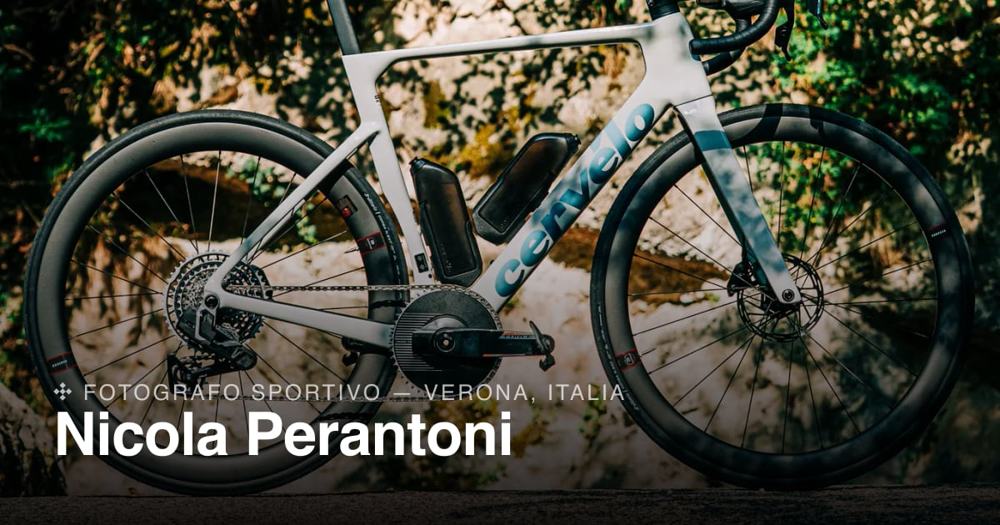

# Nicola Perantoni — Portfolio

[](https://www.nicolaperantoni.com)
[](https://astro.build)
[](https://www.typescriptlang.org)

Sito portfolio one-page per **Nicola Perantoni**, fotografo sportivo con base a Verona. La metafora visiva è la cartografia topografica: curve di livello generate proceduralmente su canvas, quote in metri, marker GPS che si muovono lungo le curve e si collegano tra loro con linee di telemetria — un flusso masonry di fotografie verticali interrotto da frasi del manifesto personale.



**→ [www.nicolaperantoni.com](https://www.nicolaperantoni.com)**

---

## Stack

Sito statico, zero backend, zero framework UI — solo quanto serve:

- **[Astro](https://astro.build)** (output statico) + **TypeScript** per markup e componenti
- Nessun React/Vue/Svelte: gli interattivi (canvas, reveal, lightbox, masonry) sono moduli **TypeScript vanilla**, ognuno isolato e senza dipendenze dal framework
- **`astro:assets`** (`<Picture>`) per varianti responsive AVIF/WebP con `srcset`
- **`@astrojs/sitemap`** per la sitemap generata a build
- CSS puro con custom properties per i design token — niente Tailwind
- Deploy su **Vercel**, dominio custom su Tophost

## Funzionalità

- **Mappa topografica animata** — value noise deterministico, marching squares per le curve di livello, marker GPS che percorrono le curve, etichette con coordinate/attività in scramble, linee di telemetria tra marker (incluso uno stato periodico "CONNECTION FAILED")
- **Flusso fotografico masonry** — 3/2/1 colonne responsive, note del manifesto interlacciate, reveal allo scroll con "contour wipe" sulle foto e righe di testo che salgono riga per riga
- **Lightbox** con navigazione da tastiera e contatore
- **Boot sequence** dei tre indicatori di stato (GPS/Device/Athlete) con effetto scramble
- **`prefers-reduced-motion`** rispettato ovunque: mappa a singolo frame, niente wipe/scramble/parallasse
- **SEO completa**: meta assoluti, Open Graph, Twitter card, JSON-LD `ProfessionalService`, sitemap, robots.txt, favicon, preview social dedicata

## Sviluppo

```bash
npm install
npm run dev      # http://localhost:4321
npm run build    # output statico in dist/
npm run preview  # serve la build di produzione
npm run check    # type-check (astro check)
```

Richiede Node **18.20.8 / 20.3+ / 22+**.

Script accessori (rigenerano gli asset in `public/`, non servono per lo sviluppo quotidiano):

```bash
npm run icons     # favicon.ico + apple-touch-icon.png da favicon.svg
npm run og-image  # preview social 1200×630
```

## Struttura

```
src/
├── components/       # un componente Astro per sezione (Hero, Work, Studio, Contacts, Footer, Veil, Lightbox)
├── layouts/
│   └── BaseLayout.astro   # <head>, meta SEO, JSON-LD
├── lib/               # logica client-side, vanilla TS, framework-agnostic
│   ├── topo-map.ts        # mappa topografica — vedi sotto
│   ├── reveal.ts           # IntersectionObserver + split delle righe di testo
│   ├── flow-layout.ts      # masonry responsive
│   ├── lightbox.ts
│   ├── boot-status.ts      # scramble degli indicatori di stato
│   ├── word-cycle.ts       # parola rotante dell'hero (Web Animations API)
│   └── veil.ts              # overlay di caricamento + preload foto
├── data/
│   └── content.ts     # progetti, note manifesto, servizi, algoritmo del flusso
├── styles/
│   └── global.css     # design token, keyframes, prefers-reduced-motion
└── pages/
    └── index.astro
```

## Design token

### Colori

| Ruolo | Valore |
|---|---|
| Sfondo pagina | `rgb(175, 175, 175)` |
| Testo principale | `#101114` |
| Testo secondario | `rgba(16, 17, 20, 0.68)` |
| Testo tenue | `rgba(16, 17, 20, 0.55)` |
| Testo tenue (min) | `rgba(16, 17, 20, 0.45)` |
| Card servizi | `rgba(16, 17, 20, 0.07)` |
| Pannello hero | `#000000` |
| Lightbox | `rgba(12, 12, 14, 0.95)` |
| Testo su nero | `#ffffff` |
| Testo su nero (secondario) | `rgba(255, 255, 255, 0.66)` |
| **Accento** (mappa, marker, link) | `#c8b892` |
| LED attivo | `#5ee08a` |
| LED boot | `#e8912f` |
| Errore / connection failed | `#d6432f` |

Alternative per l'accento della mappa (prop `accent` del modulo): `#5ee08a` · `#e8912f` · `#9fb8c8`.

### Tipografia

- **[Archivo](https://fonts.google.com/specimen/Archivo)** 300/400/500/600 — corpo del sito, peso base **300**
- **[IBM Plex Mono](https://fonts.google.com/specimen/IBM+Plex+Mono)** 400/500 — dati, etichette, contatti
- **[Instrument Serif](https://fonts.google.com/specimen/Instrument+Serif)** italic — accenti editoriali nei titoli

### Motion

Easing firma `cubic-bezier(.2,.7,.2,1)` su reveal, wipe e righe di testo. Durate ricorrenti: 320ms (lightbox), 550ms (veil), 820ms (righe), 850ms (revealUp), 1150ms (contour wipe), 1900ms (parola rotante).

## Il modulo mappa topografica

La logica del canvas vive isolata in [`src/lib/topo-map.ts`](src/lib/topo-map.ts) — nessun import da Astro o da altro codice del sito, riusabile così com'è in qualsiasi progetto:

```ts
import { createTopoMap } from './lib/topo-map';

const controller = createTopoMap(staticCanvas, markerCanvas, {
  accent: '#c8b892',   // colore marker, etichette e linee
  markers: 10,         // int 0–16, numero di marker GPS
  showElevation: true, // mostra/nasconde le quote sulle curve
});

controller.setOptions({ accent: '#5ee08a' }); // ridisegna con i nuovi parametri
controller.destroy();                          // ferma il loop e rimuove i listener
```

Rispetta `prefers-reduced-motion` internamente: disegna un solo frame, senza marker in movimento né linee/etichette animate.

## Deploy

Push su `main` → build e deploy automatico su **Vercel**. Dominio `nicolaperantoni.com` gestito su Tophost, con redirect 308 dall'apex a `www.nicolaperantoni.com` (host canonico usato in tutti gli URL assoluti/SEO).

## Crediti fotografici

Fotografie di Nicola Perantoni per **PH Apparel × Cérvelo**, **Zullo Bike**, **Ristora**, **PH Apparel Spring Camp** — tutti i diritti riservati.

---

© 2026 Nicola Perantoni
